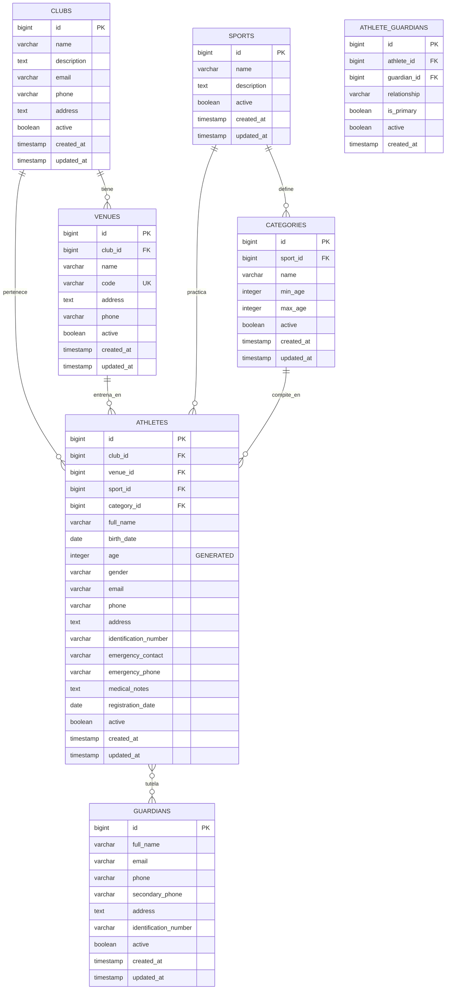

# Database Schema Documentation
## Sistema de Gestión Deportiva

### Información General
- **SGBD**: PostgreSQL 15+
- **Codificación**: UTF-8
- **Timezone**: UTC
- **Última actualización**: 2025-08-04

---

## Diagrama de Entidad-Relación



---

## Documentación de Tablas

### CLUBS
**Propósito**: Almacena información de organizaciones deportivas (clubes, escuelas de formación).

| Campo | Tipo | Restricciones | Descripción |
|-------|------|---------------|-------------|
| `id` | BIGSERIAL | PRIMARY KEY | Identificador único autoincrementable |
| `name` | VARCHAR(255) | NOT NULL | Nombre oficial del club |
| `description` | TEXT | | Descripción detallada del club |
| `email` | VARCHAR(255) | | Email de contacto principal |
| `phone` | VARCHAR(50) | | Teléfono de contacto |
| `address` | TEXT | | Dirección física del club |
| `active` | BOOLEAN | DEFAULT true | Estado activo/inactivo |
| `created_at` | TIMESTAMP | DEFAULT NOW() | Fecha de creación |
| `updated_at` | TIMESTAMP | DEFAULT NOW() | Última actualización (auto) |

**Reglas de Negocio**:
- Un club puede tener múltiples sedes
- Un club puede ofrecer múltiples disciplinas deportivas
- Solo clubes activos pueden registrar nuevos atletas

---

### VENUES
**Propósito**: Representa las sedes físicas donde entrenan los atletas.

| Campo | Tipo | Restricciones | Descripción |
|-------|------|---------------|-------------|
| `id` | BIGSERIAL | PRIMARY KEY | Identificador único |
| `club_id` | BIGINT | NOT NULL, FK → clubs(id) | Club propietario |
| `name` | VARCHAR(255) | NOT NULL | Nombre de la sede |
| `code` | VARCHAR(50) | UNIQUE, NOT NULL | Código único identificador |
| `address` | TEXT | | Dirección de la sede |
| `phone` | VARCHAR(50) | | Teléfono específico de la sede |
| `active` | BOOLEAN | DEFAULT true | Estado operativo |
| `created_at` | TIMESTAMP | DEFAULT NOW() | Fecha de creación |
| `updated_at` | TIMESTAMP | DEFAULT NOW() | Última actualización |

**Reglas de Negocio**:
- Cada sede pertenece a un único club
- El código debe ser único en todo el sistema
- Atletas deben estar asignados a una sede específica

---

### SPORTS
**Propósito**: Catálogo configurable de disciplinas deportivas.

| Campo | Tipo | Restricciones | Descripción |
|-------|------|---------------|-------------|
| `id` | BIGSERIAL | PRIMARY KEY | Identificador único |
| `name` | VARCHAR(255) | NOT NULL | Nombre del deporte |
| `description` | TEXT | | Descripción detallada |
| `active` | BOOLEAN | DEFAULT true | Disponible para registro |
| `created_at` | TIMESTAMP | DEFAULT NOW() | Fecha de creación |
| `updated_at` | TIMESTAMP | DEFAULT NOW() | Última actualización |

**Reglas de Negocio**:
- Solo deportes activos aparecen en formularios de registro
- Un deporte puede tener múltiples categorías por edad

---

### CATEGORIES
**Propósito**: Categorías competitivas por deporte y rango de edad.

| Campo | Tipo | Restricciones | Descripción |
|-------|------|---------------|-------------|
| `id` | BIGSERIAL | PRIMARY KEY | Identificador único |
| `sport_id` | BIGINT | NOT NULL, FK → sports(id) | Deporte asociado |
| `name` | VARCHAR(255) | NOT NULL | Nombre de la categoría |
| `min_age` | INTEGER | NOT NULL | Edad mínima inclusiva |
| `max_age` | INTEGER | NOT NULL | Edad máxima inclusiva |
| `active` | BOOLEAN | DEFAULT true | Disponible para registro |
| `created_at` | TIMESTAMP | DEFAULT NOW() | Fecha de creación |
| `updated_at` | TIMESTAMP | DEFAULT NOW() | Última actualización |

**Constraints**:
- `CHECK (min_age <= max_age)` - Rango de edad válido

**Reglas de Negocio**:
- Los rangos pueden solaparse entre categorías
- La edad del atleta debe estar dentro del rango al momento del registro

---

### ATHLETES
**Propósito**: Registro central de todos los atletas del sistema.

| Campo | Tipo | Restricciones | Descripción |
|-------|------|---------------|-------------|
| `id` | BIGSERIAL | PRIMARY KEY | Identificador único |
| `club_id` | BIGINT | NOT NULL, FK → clubs(id) | Club de pertenencia |
| `venue_id` | BIGINT | NOT NULL, FK → venues(id) | Sede de entrenamiento |
| `sport_id` | BIGINT | NOT NULL, FK → sports(id) | Disciplina deportiva |
| `category_id` | BIGINT | NOT NULL, FK → categories(id) | Categoría competitiva |
| `full_name` | VARCHAR(255) | NOT NULL | Nombre completo |
| `birth_date` | DATE | NOT NULL | Fecha de nacimiento |
| `age` | INTEGER | GENERATED ALWAYS AS (...) STORED | Edad calculada automáticamente |
| `gender` | VARCHAR(10) | | Género del atleta |
| `email` | VARCHAR(255) | | Email personal (opcional) |
| `phone` | VARCHAR(50) | | Teléfono personal |
| `address` | TEXT | | Dirección de residencia |
| `identification_number` | VARCHAR(50) | | Número de documento |
| `emergency_contact` | VARCHAR(255) | | Contacto de emergencia |
| `emergency_phone` | VARCHAR(50) | | Teléfono de emergencia |
| `medical_notes` | TEXT | | Observaciones médicas |
| `registration_date` | DATE | DEFAULT CURRENT_DATE | Fecha de inscripción |
| `active` | BOOLEAN | DEFAULT true | Estado activo |
| `created_at` | TIMESTAMP | DEFAULT NOW() | Fecha de creación |
| `updated_at` | TIMESTAMP | DEFAULT NOW() | Última actualización |

**Constraints**:
- `CHECK (birth_date <= CURRENT_DATE)` - Fecha de nacimiento válida

**Reglas de Negocio**:
- Atletas menores de 18 años requieren al menos un tutor
- La edad se calcula automáticamente y se mantiene actualizada
- Un atleta puede cambiar de categoría si su edad ya no corresponde

---

### GUARDIANS
**Propósito**: Información de tutores/guardianes de atletas menores.

| Campo | Tipo | Restricciones | Descripción |
|-------|------|---------------|-------------|
| `id` | BIGSERIAL | PRIMARY KEY | Identificador único |
| `full_name` | VARCHAR(255) | NOT NULL | Nombre completo del tutor |
| `email` | VARCHAR(255) | | Email de contacto |
| `phone` | VARCHAR(50) | | Teléfono principal |
| `secondary_phone` | VARCHAR(50) | | Teléfono alternativo |
| `address` | TEXT | | Dirección de residencia |
| `identification_number` | VARCHAR(50) | | Número de documento |
| `active` | BOOLEAN | DEFAULT true | Estado activo |
| `created_at` | TIMESTAMP | DEFAULT NOW() | Fecha de creación |
| `updated_at` | TIMESTAMP | DEFAULT NOW() | Última actualización |

**Reglas de Negocio**:
- Un tutor puede estar asociado a múltiples atletas
- Al menos un método de contacto (email o phone) debe estar presente

---

### ATHLETE_GUARDIANS
**Propósito**: Relación many-to-many entre atletas y sus tutores.

| Campo | Tipo | Restricciones | Descripción |
|-------|------|---------------|-------------|
| `id` | BIGSERIAL | PRIMARY KEY | Identificador único |
| `athlete_id` | BIGINT | NOT NULL, FK → athletes(id) CASCADE | Atleta asociado |
| `guardian_id` | BIGINT | NOT NULL, FK → guardians(id) | Tutor asociado |
| `relationship` | VARCHAR(50) | NOT NULL | Tipo de parentesco |
| `is_primary` | BOOLEAN | DEFAULT false | Tutor principal |
| `active` | BOOLEAN | DEFAULT true | Relación activa |
| `created_at` | TIMESTAMP | DEFAULT NOW() | Fecha de creación |

**Constraints**:
- `UNIQUE(athlete_id, guardian_id)` - Evita duplicados

**Reglas de Negocio**:
- Un atleta menor debe tener al menos un tutor activo
- Solo un tutor puede ser marcado como primario por atleta
- Valores comunes para `relationship`: "padre", "madre", "tutor", "abuelo", "tío", etc.

---

## Índices y Performance

### Índices Principales

```sql
-- Consultas por club y sede
CREATE INDEX idx_athletes_club_venue ON athletes(club_id, venue_id);

-- Consultas por deporte y categoría  
CREATE INDEX idx_athletes_sport_category ON athletes(sport_id, category_id);

-- Filtros por estado activo (índice parcial)
CREATE INDEX idx_athletes_active ON athletes(active) WHERE active = true;

-- Ordenamiento por fecha de nacimiento
CREATE INDEX idx_athletes_birth_date ON athletes(birth_date);

-- Relaciones foráneas
CREATE INDEX idx_venues_club ON venues(club_id);
CREATE INDEX idx_categories_sport ON categories(sport_id);
CREATE INDEX idx_athlete_guardians_athlete ON athlete_guardians(athlete_id);
CREATE INDEX idx_athlete_guardians_guardian ON athlete_guardians(guardian_id);
```

### Consultas Optimizadas Comunes

#### 1. Listar atletas por sede con información completa
```sql
SELECT 
    a.id,
    a.full_name,
    a.age,
    s.name as sport_name,
    c.name as category_name,
    v.name as venue_name,
    cl.name as club_name
FROM athletes a
JOIN sports s ON a.sport_id = s.id
JOIN categories c ON a.category_id = c.id
JOIN venues v ON a.venue_id = v.id
JOIN clubs cl ON a.club_id = cl.id
WHERE a.venue_id = ? AND a.active = true
ORDER BY a.full_name;
```

#### 2. Atletas menores con sus tutores
```sql
SELECT 
    a.id,
    a.full_name,
    a.age,
    g.full_name as guardian_name,
    ag.relationship,
    ag.is_primary,
    g.phone as guardian_phone
FROM athletes a
JOIN athlete_guardians ag ON a.id = ag.athlete_id
JOIN guardians g ON ag.guardian_id = g.id
WHERE a.age < 18 AND a.active = true AND ag.active = true
ORDER BY a.full_name, ag.is_primary DESC;
```

#### 3. Validar categoría por edad
```sql
SELECT c.*
FROM categories c
JOIN sports s ON c.sport_id = s.id
WHERE s.id = ? 
  AND ? BETWEEN c.min_age AND c.max_age
  AND c.active = true;
```

#### 4. Estadísticas por sede
```sql
SELECT 
    v.name as venue_name,
    s.name as sport_name,
    COUNT(*) as total_athletes,
    COUNT(CASE WHEN a.age < 18 THEN 1 END) as minors,
    COUNT(CASE WHEN a.age >= 18 THEN 1 END) as adults
FROM athletes a
JOIN venues v ON a.venue_id = v.id
JOIN sports s ON a.sport_id = s.id
WHERE a.active = true
GROUP BY v.id, v.name, s.id, s.name
ORDER BY v.name, s.name;
```

---

## Triggers y Funciones

### Función para actualizar updated_at
```sql
CREATE OR REPLACE FUNCTION update_updated_at_column()
RETURNS TRIGGER AS $$
BEGIN
    NEW.updated_at = CURRENT_TIMESTAMP;
    RETURN NEW;
END;
$$ language 'plpgsql';
```

### Triggers aplicados
- `update_clubs_updated_at`
- `update_venues_updated_at`  
- `update_sports_updated_at`
- `update_categories_updated_at`
- `update_guardians_updated_at`
- `update_athletes_updated_at`

---

## Consideraciones de Escalabilidad

### Particionado (Futuro)
Para > 10K atletas, considerar particionado de `athletes` por:
- **Temporal**: Por año de registro
- **Geográfico**: Por club_id si hay muchos clubes

### Archivado
- Atletas inactivos > 2 años → tabla `athletes_archived`
- Mantener integridad referencial con soft deletes

### Monitoring
- Monitorear consultas lentas > 1s
- Alertas por crecimiento de tablas > 80% espacio
- Estadísticas de uso de índices

---

## Scripts de Migración

### Creación inicial
```bash
# Ubicación: src/main/resources/db/migration/
V001__create_initial_schema.sql
V002__create_indexes.sql  
V003__create_triggers.sql
V004__insert_seed_data.sql
```

### Datos semilla sugeridos
```sql
-- Deportes básicos
INSERT INTO sports (name, description) VALUES 
('Fútbol', 'Fútbol asociación'),
('Natación', 'Natación deportiva'),
('Baloncesto', 'Baloncesto masculino y femenino'),
('Tenis', 'Tenis individual y dobles');

-- Categorías ejemplo para Fútbol
INSERT INTO categories (sport_id, name, min_age, max_age) VALUES 
(1, 'Infantil', 6, 10),
(1, 'Juvenil', 11, 15),
(1, 'Cadete', 16, 18),
(1, 'Adulto', 19, 40);
```

---

## Notas de Implementación

### Validaciones Recomendadas
- **Email**: Formato válido cuando presente
- **Phone**: Formato local válido
- **Age vs Category**: Edad dentro del rango de la categoría
- **Guardian requirement**: Atletas < 18 deben tener ≥ 1 tutor activo

### Campos Auditables
Todas las tablas principales incluyen:
- `created_at`: Timestamp de creación
- `updated_at`: Timestamp de última modificación (auto-actualizado)
- `active`: Soft delete para mantener integridad referencial

### Backup y Recovery
- Backup diario completo recomendado
- Retention: 30 días para backups diarios
- Backup antes de migraciones de schema